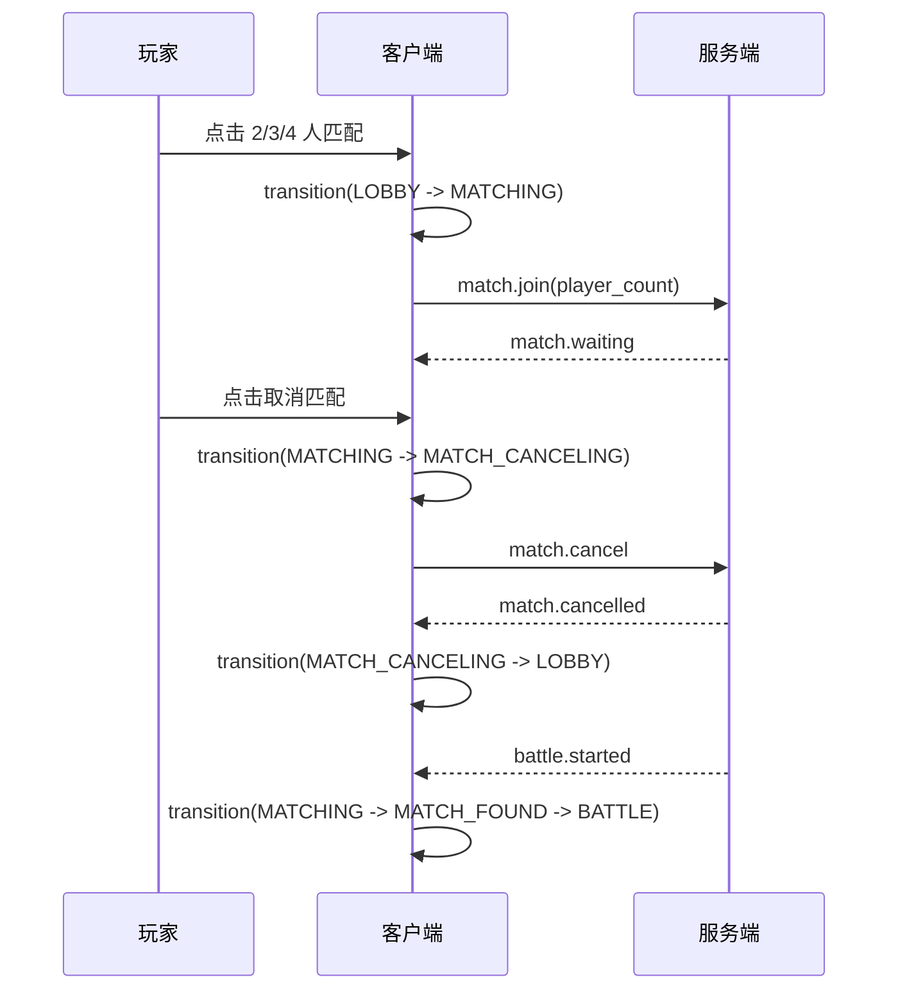

# GunTanks 客户端界面与匹配状态机改造需求

## 1. 文档目的

本需求用于指导 Codex 改造 `C:\GoProject\GunTanks\guntanks-client` 客户端，解决当前所有按键和业务入口混在一个页面、事件互相影响、错误操作后可能卡死的问题。

本次改造只处理客户端页面组织、按键交互和匹配流程，不改变既定的服务端权威战斗规则。创建房间、加入房间及组队功能本阶段搁置，客户端移除相关入口和调用，只保留自动匹配；后续仍可单独设计并恢复房间功能。

## 2. 当前问题

当前客户端主要问题如下：

- `index.html` 同时包含登录、大厅、匹配、创建房间、加入房间、准备、开始、离开房间和战斗控制区域。
- `main.js` 同时绑定认证、匹配、房间、战斗、键盘和指针事件，缺少统一的页面状态控制。
- `show()` 只切换 `auth`、`lobby`、`battle` 三个区域，不能表达“匹配中”“匹配成功待进入”“重连中”“结算”等中间状态。
- 房间按钮通过 HTTP `/rooms` 直接操作，而匹配通过 WebSocket/HTTP 混合处理，导致状态来源不统一。
- 当前匹配按钮实际调用 HTTP `POST /api/v1/matches`，没有独立匹配页面和取消匹配流程；服务端已有 WebSocket `match.join`、`match.cancel` 消息，应统一客户端匹配入口到 WebSocket。
- `send()` 只检查 `store.battle`，未统一检查当前页面、连接状态、战斗阶段、是否轮到本人和输入锁定状态。
- 全局键盘监听在登录、大厅、匹配等页面仍然存在，用户在输入框中按方向键、空格或其他按键可能触发游戏命令。
- 方向键同时存在键盘按钮和鼠标/触摸按钮两套输入路径，缺少统一的按下、释放、取消和失焦清理。
- 发射、选武器、离开战斗等按钮没有统一防重复提交机制。
- 房间状态字段、房间按钮和房间消息会与匹配状态互相覆盖，错误处理后容易停留在不可操作页面。
- WebSocket 自动重连后没有统一恢复到正确业务页面；连接状态和业务状态没有分层管理。

## 3. 本次范围

### 3.1 必须实现

- 采用互斥页面：同一时间只显示一个业务页面。
- 采用集中式客户端状态机，所有页面切换只能经过状态机。
- 登录后进入大厅；大厅只保留 2 人、3 人、4 人匹配入口和战绩入口。
- 点击匹配后进入独立的“匹配中”页面。
- 匹配中显示匹配人数、等待状态、已等待时间和“取消匹配”按钮。
- 匹配中允许取消，取消后回到大厅，不进入战斗，不保留旧匹配状态。
- 匹配成功后进入“匹配成功/准备进入战斗”过渡状态，再进入战斗页面。
- 战斗页面只显示战斗画布和当前战斗操作。
- 战斗结束后进入独立结算页面，可返回大厅。
- 重连过程中进入独立的“连接恢复中”状态，恢复完成前禁止战斗输入。
- 所有键盘、鼠标和触摸输入都必须有页面状态和战斗权限守卫。
- 统一处理按键按下、释放、重复触发、窗口失焦、页面隐藏和输入取消。
- 删除创建房间、加入房间以及相关准备、开始、离开房间功能。

### 3.2 明确删除

以下内容必须从客户端本阶段删除，不得仅隐藏按钮。服务端对应实现可以暂时保留，但客户端不得再调用：

- `room-id` 输入框。
- 创建房间按钮。
- 加入房间按钮。
- 房间准备按钮。
- 房间开始按钮。
- 离开房间按钮。
- 房间状态展示区域。
- `store.room` 字段及其读写函数。
- `setRoom()` 和 `roomAction()`。
- `/rooms` 相关 HTTP 请求。
- `room.create`、`room.join`、`room.ready`、`room.start`、`room.leave` 客户端消息。
- 房间状态机、房主、准备状态和房间迁移逻辑。
- 与房间相关的 CSS、文案、错误码分支和测试用例。

本次客户端需求不要求删除服务端房间代码；服务端房间接口是否停用由后续服务端任务决定，但客户端必须与房间功能完全解耦。

## 3.3 当前实现基线

以下事实以当前 `guntanks-client` 代码为准，Codex 实现时必须先以此为起点：

- `index.html` 当前仍同时存在登录、大厅、匹配、房间和战斗区域；没有匹配中、结算或重连页面。
- `src/main.js` 使用 `show()` 只在 `auth/lobby/battle` 三个区域之间切换。
- `src/store.js` 仍有 `room` 字段。
- `src/main.js` 仍绑定 `create-room`、`join-room`、`ready-room`、`start-room`、`leave-room` 和 `roomAction()`。
- 匹配按钮目前调用 HTTP `POST /api/v1/matches`，成功后可能直接进入战斗；改造后必须使用 WebSocket `match.join` 和 `match.cancel`，并先进入 `MATCHING` 页面。
- `src/main.js` 在模块加载时注册全局 `keydown`、`keyup`；当前未按页面状态、战斗权限或连接状态统一拦截。
- `[data-cmd]` 按钮当前直接在 `pointerdown/pointerup` 中发送 start/stop，没有 held 状态去重，也没有统一处理 `blur`、`visibilitychange`、`pointercancel` 以外的输入清理。
- `src/socket.js` 当前支持 WebSocket 自动重连和 event sequence 检查，但没有把连接状态发布给页面状态机，也没有恢复匹配页面状态。

### 3.4 本次新增账号与在线状态要求

- 用户名和密码不设置字符数上下限；去除首尾空白后不得为空。
- 客户端和服务端均必须执行非空校验；校验失败时不得发起登录或注册请求。
- 用户关闭网页导致 WebSocket 断开时，服务端必须立即释放该会话持有的 Redis 在线锁，不得要求等待在线 TTL 自然过期。
- 在线锁必须按 `user_id + session_id/generation` 条件释放，不能删除后来新登录会话持有的在线锁。
- 主动退出登录和网页关闭使用同一套在线锁清理逻辑；清理失败必须记录服务端日志。
- 在线登录状态与战斗重连状态分开维护；释放在线锁不得误删战斗重连状态。

## 4. 页面结构

客户端页面必须改为以下互斥页面。建议采用一个 `appState` 根状态和一个页面渲染器，禁止通过多个按钮直接互相修改 `classList` 来形成隐式状态。

```text
AUTH
  -> LOBBY
  -> MATCHING
  -> MATCH_FOUND
  -> BATTLE_LOADING
  -> BATTLE
  -> RESULT
       -> LOBBY

任意已登录页面
  -> RECONNECTING
  -> 根据恢复结果返回原业务页面或 AUTH
```

### 4.1 AUTH 登录页

显示：

- 用户名输入框。
- 密码输入框。
- 登录按钮。
- 注册按钮。
- 认证错误提示。

行为：

- 登录或注册请求期间禁用两个提交按钮，防止重复请求。
- 认证成功后建立 WebSocket 连接，并切换到 `LOBBY`。
- 认证失败只更新本页错误提示，不改变页面状态。
- 登录页的键盘事件只服务于输入框和表单，不发送任何战斗命令。
- 用户名和密码输入框只校验去除首尾空白后非空，不限制字符数量。

### 4.2 LOBBY 大厅页

显示：

- 当前用户名和退出登录按钮。
- `2 人匹配`、`3 人匹配`、`4 人匹配` 三个匹配按钮。
- 战绩列表和刷新战绩按钮。
- 大厅状态提示。

删除：

- 所有房间输入、房间按钮和房间状态展示。

行为：

- 只有大厅状态下允许点击匹配按钮。
- 发起匹配后立即切换到 `MATCHING`，三个匹配按钮全部失效。
- 大厅页面的方向键、空格、数字键不得发送战斗命令。
- 退出登录前应取消当前非战斗连接状态；退出后清理 token、业务状态和输入状态。

### 4.3 MATCHING 匹配中页

显示：

- 当前匹配人数：2 人、3 人或 4 人。
- “正在匹配”状态。
- 已等待时间。
- 取消匹配按钮。
- 服务端错误或断线提示。

行为：

- 进入页面时只能存在一个匹配请求。
- 取消匹配按钮必须可重复点击而不会发送多次取消请求；第一次点击后立即进入取消中并禁用按钮。
- 收到 `match.cancelled` 后清除匹配上下文并返回 `LOBBY`。
- 收到 `battle.started` 或匹配成功事件后进入 `MATCH_FOUND`，禁止回到大厅再次发起匹配。
- WebSocket 断开时显示连接异常；自动重连期间不得继续发送匹配命令。重连后根据服务端状态恢复匹配或回到大厅。
- 浏览器刷新或页面关闭时，客户端应发送取消匹配；即使发送失败，服务端也必须依赖连接断开清理匹配状态。

### 4.4 MATCH_FOUND / BATTLE_LOADING

该状态用于隔离匹配成功事件和战斗画布初始化，避免在收到匹配消息的同一时刻仍允许用户点击大厅按钮。

- 清理旧战斗动画、旧地形 Canvas、旧输入状态和旧 event sequence。
- 初始化新 `battle_id` 对应的战斗资源。
- 接收初始快照、玩家/坦克映射、风、回合和服务端时间偏移。
- 初始化成功后进入 `BATTLE`。
- 初始化失败时显示明确错误并返回 `LOBBY`，不能停留在空白战斗页面。

### 4.5 BATTLE 战斗页

显示：

- Canvas 战斗区域。
- 当前回合玩家、回合倒计时和风信息。
- 坦克状态、武器选择和力度控制。
- 移动、调角和发射操作。
- 断线/恢复提示。
- 主动退出战斗按钮。

战斗页只能接收服务端权威状态。客户端不得通过按键直接修改坦克位置、角度、生命、回合、命中、伤害或胜负。

### 4.6 RESULT 结算页

显示：

- 获胜者或失败/中断结果。
- 本局参与者和结果。
- 返回大厅按钮。
- 可选的战绩详情入口。

行为：

- 结算状态下禁止所有战斗命令。
- 收到结算事件后停止所有键盘监听、按钮长按计时、动画和战斗倒计时。
- 返回大厅时清理本局所有客户端状态。

### 4.7 RECONNECTING 连接恢复页/遮罩

战斗中断线时不要销毁战斗状态。显示连接恢复提示和重连进度，禁止所有战斗输入。

- 重连成功后请求快照和 event 增量。
- 快照、事件序号、地形 checksum 校验成功后回到 `BATTLE`。
- 超过服务端允许的重连时间，转入 `RESULT` 或 `LOBBY`，由服务端事件决定。
- 非战斗页面断线时，可显示轻量连接提示，但不能把用户误导为正在战斗恢复。

## 5. 客户端状态机

建议集中在 `src/stateMachine.js` 或等效模块中实现。状态变更必须经过 `transition(event)`，页面代码不得直接设置任意状态字符串。

```text
AUTH
  LOGIN_SUBMIT -> AUTH_LOADING
  LOGIN_SUCCESS -> LOBBY

LOBBY
  MATCH_2/3/4 -> MATCHING
  LOGOUT -> AUTH

MATCHING
  MATCH_CANCEL -> MATCH_CANCELING
  MATCH_SUCCESS -> MATCH_FOUND
  WS_DISCONNECTED -> MATCHING_RECONNECTING

MATCH_CANCELING
  CANCEL_SUCCESS -> LOBBY
  CANCEL_ERROR -> MATCHING

MATCH_FOUND
  INITIAL_STATE_READY -> BATTLE
  INITIAL_STATE_ERROR -> LOBBY

BATTLE
  WS_DISCONNECTED -> RECONNECTING
  BATTLE_FINISHED -> RESULT
  LEAVE_CONFIRM -> LEAVING_BATTLE

LEAVING_BATTLE
  LEAVE_SUCCESS/BATTLE_FINISHED -> RESULT
  LEAVE_ERROR -> BATTLE

RECONNECTING
  RESYNC_SUCCESS -> BATTLE
  RECONNECT_TIMEOUT/BATTLE_INTERRUPTED -> RESULT
  AUTH_EXPIRED -> AUTH

RESULT
  BACK_TO_LOBBY -> LOBBY
  LOGOUT -> AUTH
```

状态机必须具备以下约束：

- 未定义的状态转换统一拒绝并记录日志。
- 同一事件重复到达必须幂等。
- 页面切换前先清理旧页面资源，再渲染新页面。
- 每个状态只注册自己需要的 DOM 和输入监听器。
- 离开状态时必须取消 timer、pointer capture、键盘 held 集合、动画帧和未完成的 UI 操作。
- 任何异步请求返回后必须检查 request generation/token，旧请求不能覆盖新页面状态。

## 6. 按键与控件逻辑

### 6.1 输入权限

战斗输入必须同时满足以下条件：

```text
page == BATTLE
&& socket == OPEN
&& battle.phase == PLAYING
&& current_user_is_alive
&& current_user_is_current_tank
&& !syncing
&& !action_locked
```

任意条件不满足时，输入事件必须被消费或忽略，不得发送到服务端。

### 6.2 移动键

- 键盘：`ArrowLeft`、`ArrowRight`。
- 页面按钮：左移、右移。
- 按下发送一次 `battle.move_start`。
- 释放发送一次 `battle.move_stop`。
- 同一个方向重复 `keydown`、重复 `pointerdown` 不得重复发送 start。
- 左右方向同时按下时，客户端不得自行决定最终位置；建议只保留最近一次有效方向，并在切换时先发送旧方向 stop，再发送新方向 start。
- `keyup`、`pointerup`、`pointercancel`、`blur`、`visibilitychange(hidden)` 都必须清理移动状态并发送 stop。

### 6.3 调角键

- 键盘：`ArrowUp`、`ArrowDown`。
- 页面按钮：调高角度、调低角度。
- 采用与移动键相同的 start/stop、去重和失焦清理规则。
- 移动键和调角键可以同时按下，但服务端仍以当前回合和固定模拟规则为准。
- 离开战斗页面时必须发送 stop 或清除本地输入状态，不能把旧按键带入下一局。

### 6.4 武器选择

- `1` 选择 Shell 1。
- `2` 选择 Shell 2。
- `3` 选择 SS，但必须先由服务端状态确认 SS 可用。
- 页面下拉框/按钮与数字键使用同一函数，不得分别维护两套选择逻辑。
- 不是当前回合、动画播放中、输入锁定中或 SS 冷却中时，控件禁用。
- 选中后发送一次 `battle.select_weapon`；重复选择相同武器可在客户端去重。
- 收到服务端拒绝后恢复服务端返回的武器状态，不能只修改本地选中样式。

### 6.5 蓄力和发射

- 空格按下开始本地力度条动画；空格释放停止动画并发送一次 `battle.fire`。
- 发射按钮执行与空格释放完全相同的提交函数。
- 空格重复 `keydown` 不得重复启动多个 interval。
- 发射提交后立即进入 `action_locked`，禁用所有战斗控制，直到收到 `battle.shot_resolved` 和下一回合权威状态。
- 发射请求失败时解除锁定并恢复服务端状态；不得让 UI 永久卡在禁用状态。
- `Enter` 等普通表单按键不得意外触发发射。
- 页面失焦时停止力度条；是否提交发射必须由明确的释放/取消策略决定，建议失焦只取消蓄力，不自动开火。

### 6.6 退出战斗

- 点击退出战斗先显示确认状态，避免误触。
- 确认后只发送一次 `battle.leave`，按钮进入提交中状态。
- 未收到服务端确认前禁止再次发送。
- 退出战斗不是退出匹配；匹配页面必须使用独立的“取消匹配”按钮。
- 退出成功进入 `RESULT`，失败则恢复 `BATTLE` 并显示错误。

### 6.7 全局输入清理

必须实现统一的 `releaseAllInputs(reason)`：

- 清空 `heldKeys`、`heldPointers` 和当前移动/调角方向。
- 清除力度条 interval。
- 释放 pointer capture。
- 取消未完成的按钮长按和重复提交 timer。
- 根据当前状态决定是否发送 move/aim stop。
- 在登录、匹配、战斗、结算、重连之间切换时调用。

## 7. WebSocket 与匹配通信

### 7.1 连接分层

将连接状态与页面状态分开：

```text
Connection: DISCONNECTED | CONNECTING | OPEN | RECONNECTING | CLOSED
Page: AUTH | LOBBY | MATCHING | MATCH_FOUND | BATTLE | RESULT
```

页面状态不得通过猜测 WebSocket readyState 得出；WebSocket 模块只发布 `connected`、`disconnected`、`message`、`reconnecting` 等事件。

### 7.2 仅保留匹配消息

客户端保留：

- `match.join`，payload `{ player_count: 2|3|4 }`。
- `match.cancel`，无 payload 或带当前匹配请求 ID。
- `match.waiting`。
- `match.cancelled`。
- `battle.started`。
- 通用 `error`。

客户端删除：

- `room.create`。
- `room.join`。
- `room.ready`。
- `room.start`。
- `room.leave`。
- 所有房间快照和房主变更消息。

### 7.3 匹配操作时序



匹配成功和取消匹配同时到达时，以服务端先处理的结果为准：

- 服务端已成功组成战斗：客户端进入战斗，取消请求返回 `BATTLE_ALREADY_STARTED`。
- 服务端尚未组成战斗：客户端回到大厅，迟到的 `battle.started` 必须被丢弃并记录异常。

### 7.4 匹配按钮防重复

- 点击任意匹配按钮后，三个匹配按钮立即禁用。
- 每次匹配操作生成 `match_request_id`。
- 只有当前 `match_request_id` 对应的响应可以改变匹配页面。
- 离开 `MATCHING` 后，旧匹配事件不能再次打开战斗页面。
- 匹配成功后清除 `match_request_id`，初始化新的 `battle_id`。

## 8. 数据结构建议

删除 `store.room`，将客户端状态收敛为：

```js
const store = {
  token: null,
  user: null,
  page: 'AUTH',
  connection: 'DISCONNECTED',
  match: null,       // { requestId, playerCount, startedAt }
  battle: null,
  input: {
    keys: new Set(),
    pointers: new Set(),
    actionLocked: false,
    charging: false,
  },
  lastEventSeq: new Map(),
};
```

推荐通过不可变更新或集中方法修改状态，避免页面模块随意写入 `store`。`battle` 只保存服务端快照和当前动画信息，不能保存一套独立的可判定战斗逻辑。

## 9. 文件改造建议

### `index.html`

- 删除整个 `.room-tools`、`room-id`、`room-state` 和所有房间按钮。
- 将认证、大厅、匹配中、战斗、结算拆为独立 section。
- 为匹配中增加等待人数、计时和取消按钮。
- 为战斗增加统一的输入禁用状态和连接提示。
- 为结算增加结果展示和返回大厅按钮。

### `src/main.js`

- 删除 `setRoom()`、`roomAction()` 和所有房间事件绑定。
- 删除 `/rooms` 请求。
- 不再通过 `show()` 直接切换页面，改为调用状态机。
- 将匹配、战斗和认证事件按当前页面/请求 ID分发。
- 将键盘、指针、按钮事件集中到输入控制模块。
- 所有异步回调检查当前状态和请求代次。

### `src/store.js`

- 删除 `room`。
- 增加 page、connection、match、input 和 loading/action lock 状态。
- 提供清理匹配、清理战斗、清理输入的方法。

### `src/socket.js`

- 只负责 WebSocket 生命周期、心跳、重连、消息序列和发送队列。
- 不直接切换页面。
- 提供取消匹配和战斗命令的统一发送接口。
- 连接恢复时发布事件，由状态机决定恢复哪个页面。

### `src/renderer.js`

- 将大厅、匹配、战斗、结算渲染拆开。
- 战斗动画期间保持输入锁定。
- 不让战斗画布渲染函数修改页面状态。

### 新增建议文件

- `src/stateMachine.js`：页面状态和转换。
- `src/inputController.js`：键盘、鼠标、触摸、失焦和统一清理。
- `src/viewManager.js`：互斥页面显示和页面进入/离开钩子。
- `src/matchController.js`：匹配请求、取消、超时和事件过滤。

文件名可以按现有代码风格调整，但职责必须保持分离。

## 10. 错误恢复要求

| 场景 | 客户端行为 |
|---|---|
| 重复点击匹配 | 第一次生效，后续点击无效 |
| 匹配请求失败 | 返回大厅，恢复三个匹配按钮 |
| 取消匹配失败 | 留在匹配中，提示重试 |
| 匹配期间断线 | 显示连接恢复，禁止新的匹配操作 |
| 匹配取消后收到旧成功事件 | 按 request ID 丢弃，不进入战斗 |
| 发射重复点击 | 只提交一次，直到服务端确认 |
| 战斗中刷新页面 | 按既有重连协议恢复；恢复完成前禁止输入 |
| 战斗结束后按方向键 | 不发送命令，不改变结算页面 |
| 窗口失焦 | 停止所有连续输入和力度计时 |
| token 过期 | 清理本地状态并返回登录页 |
| 关闭网页后重新登录 | WebSocket 断开后服务端释放在线锁，重新登录不得因旧会话残留而失败 |

错误提示必须面向用户，网络错误、服务端错误和非法状态错误不得导致页面空白或永久 loading。

## 11. 测试与验收

### 11.1 页面测试

- 登录页只响应登录/注册，不响应战斗按键。
- 大厅只显示匹配和战绩，不显示任何房间入口。
- 匹配中只显示取消匹配，不显示战斗控制。
- 战斗页只显示战斗控制，不显示匹配和房间按钮。
- 结算页不响应战斗输入。
- 任意时刻只有一个主页面可见。

### 11.2 输入测试

- 键盘和页面按钮发送相同的 start/stop 命令。
- 长按不产生重复 interval 或重复 start 消息。
- `keyup`、`pointercancel`、窗口失焦和页面隐藏均能释放输入。
- 移动、调角、武器选择、力度和发射互不误触。
- 发射过程中所有相关控件正确锁定并在成功/失败后恢复。
- 非当前回合无法发送有效战斗命令。

### 11.3 匹配测试

- 2/3/4 人匹配请求分别进入对应队列。
- 匹配中取消后回到大厅，并能再次匹配。
- 连续点击匹配只发送一次请求。
- 取消和匹配成功竞态按服务端结果处理。
- 匹配期间断线重连后状态正确恢复。
- 房间相关 DOM、请求、消息和状态字段全部不存在或不可达。

### 11.4 自动化验收

至少增加以下可重复测试：

- `AUTH -> LOBBY -> MATCHING -> LOBBY`。
- `AUTH -> LOBBY -> MATCHING -> MATCH_FOUND -> BATTLE -> RESULT -> LOBBY`。
- 战斗中 `BATTLE -> RECONNECTING -> BATTLE`。
- 所有页面状态下发送方向键、空格、数字键，确认只有 `BATTLE` 且满足权限时才产生战斗消息。
- 旧请求、旧 event_seq、旧 battle_id 和旧 match_request_id 不得覆盖当前状态。
- 前端构建通过，浏览器控制台无未处理异常。

## 12. 实施顺序

1. 先删除房间 DOM、`store.room`、房间请求和房间消息分支。
2. 建立互斥页面结构和页面状态机。
3. 抽离统一输入控制器，完成按键释放和失焦清理。
4. 重构匹配控制器，加入匹配中页面和取消匹配。
5. 接入现有 WebSocket 重连和战斗恢复流程。
6. 完成发射、武器、移动和调角的输入权限锁定。
7. 增加页面、输入、匹配竞态和重连测试。
8. 最后删除无引用的房间 CSS、函数、常量和构建产物引用。

## 13. 验收标准

- 客户端存在登录、大厅、匹配中、战斗、结算和连接恢复等清晰页面状态。
- 页面之间互斥显示，不同页面的按钮和键盘事件不会互相触发。
- 2/3/4 人匹配功能正常，匹配中可以取消并重新匹配。
- 创建房间、加入房间、准备、开始房间、离开房间相关代码和 UI 已删除。
- 任意连续按键、重复点击、失焦、断线和页面切换都不会导致永久 loading 或输入锁死。
- 发射、移动、调角和选武器只能在当前玩家自己的有效回合发送。
- 客户端不恢复本地权威战斗计算，不因 UI 重构改变服务端战斗规则。
- 前端构建成功，关键流程和浏览器自动化测试通过。
- 用户名和密码仅允许去除首尾空白后非空，不受字符数量限制。
- 关闭网页后 Redis 在线锁立即按旧会话安全释放，重新登录成功；不得误删新会话的在线锁。
