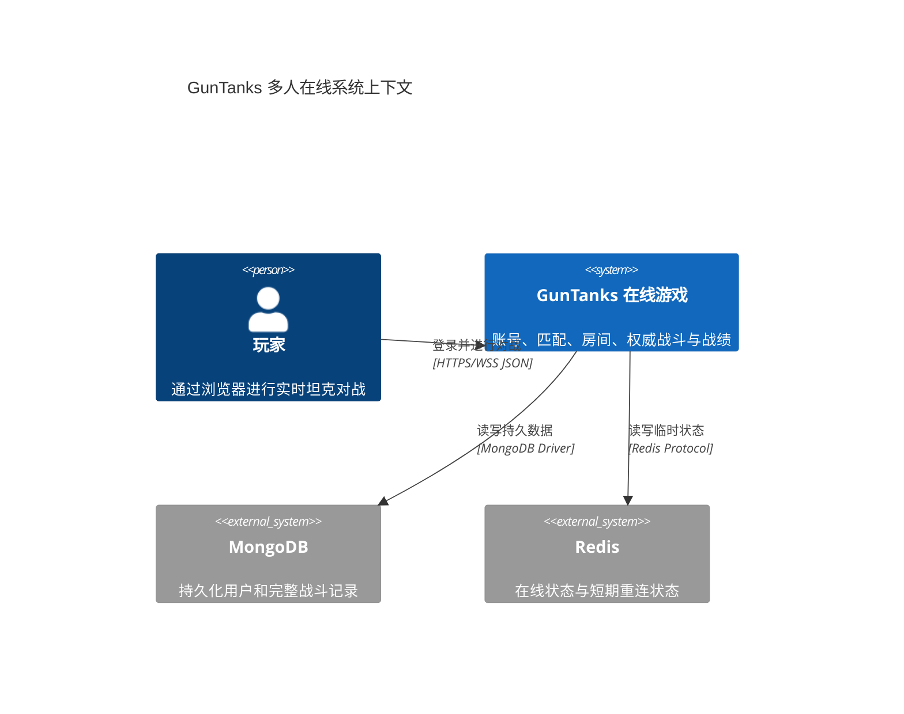
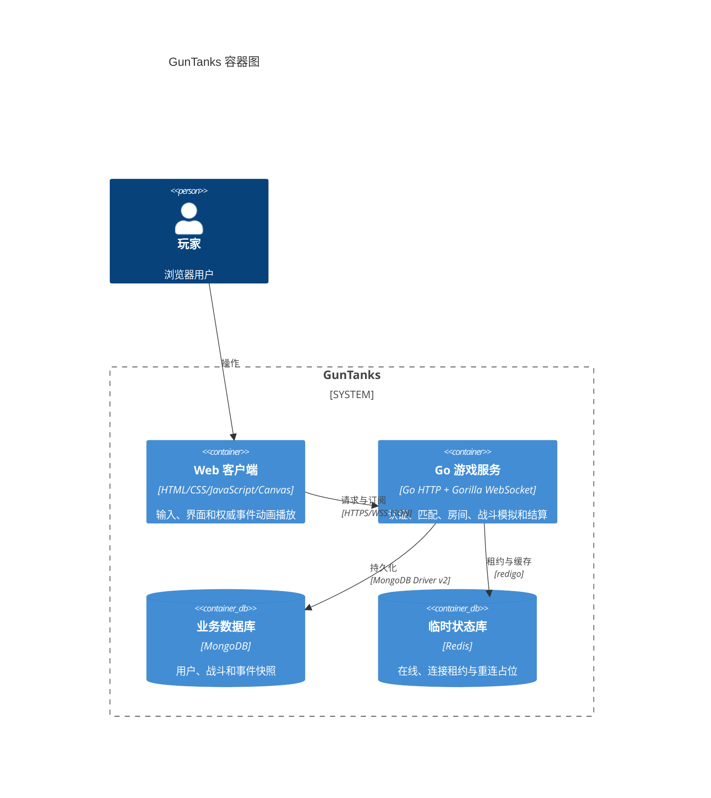
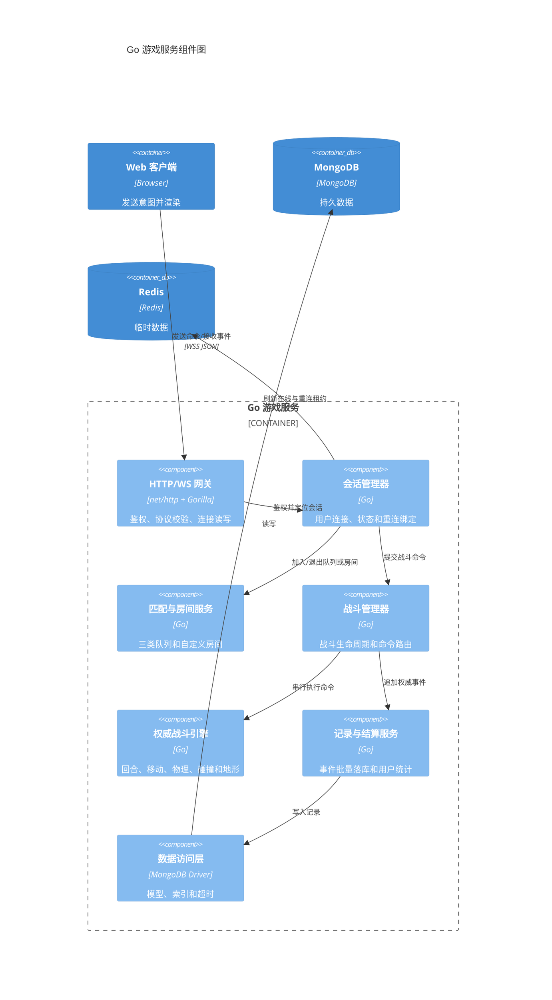
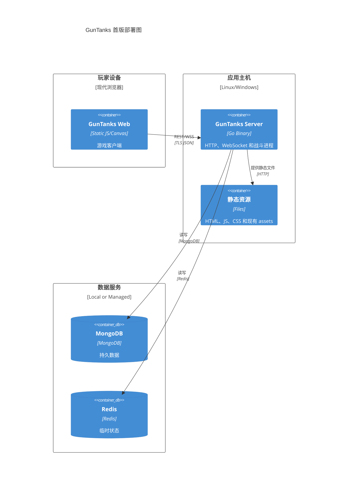

# GunTanks 多人在线客户端/服务端设计方案

> 文档状态：实施基线 1.0  
> 目标代码目录：`C:\GoProject\GunTanks`  
> 现有客户端目录：`C:\GoProject\GunTanks\Guntanks`  
> 参考服务端：`C:\GoProject\gobang`  
> 本文中的“必须”是实现与验收要求；标为“默认”的数值必须配置化。

## 1. 目标与边界

将现有纯浏览器、本地四坦克轮流操作的 GunTanks 改造为 2 至 4 名真实玩家在线对战游戏。保留当前 Canvas 画面、图片、音频、操作手感和战斗规则，以 Go 服务端作为唯一权威，客户端只提交操作意图并播放服务端结果。

首版必须包含：

- 注册、登录、退出登录和单账号在线控制。
- 2 人、3 人、4 人三个独立自动匹配队列。
- 可创建、加入、准备、离开和开始的自定义房间。
- 一名玩家控制一辆坦克的自由混战，最后存活者获胜。
- 服务端权威的移动、角度、回合、风、炮弹、碰撞、伤害、地形破坏、死亡和结算。
- 60 秒断线重连；掉线不暂停战斗。
- MongoDB 用户、房间结算及完整战斗事件持久化。
- Redis 在线状态、重连占位和必要的临时状态。
- 战绩列表和战斗详情查询，不制作录像播放器界面。
- 复用 `Guntanks/assets` 内现有资源。

首版明确不包含：

- 人机对战、AI 对战、Bot、AI 观战或任何 AI 接口。
- 组队战、观战、排行榜、聊天、道具商城和付费系统。
- TCP、Protobuf、原生客户端协议。
- 多个服务端实例共同承载同一场战斗。首版按单战斗进程设计，但数据和接口不得阻碍后续横向扩展。

## 2. 已确认的产品决策

| 项目 | 决策 |
|---|---|
| 权威模型 | 服务端权威；客户端不决定命中、伤害或地形 |
| 人数 | 每局 2 至 4 人 |
| 模式 | 仅自由混战，一人一辆坦克 |
| 入口 | 2/3/4 人自动匹配 + 自定义房间 |
| 账号 | MongoDB 用户、bcrypt 密码、Redis 在线状态 |
| 通信 | HTTP REST + WebSocket JSON |
| 地形 | 实时破坏事件 + 服务端权威碰撞图 + 周期压缩快照 |
| 弹道 | 服务端一次性计算，发送采样轨迹和命中结果 |
| 掉线 | 战斗继续，60 秒内可重连，超时判负 |
| 记录 | 保存完整记录；首版仅查询，不实现回放 UI |
| 观战/AI | 均不实现 |

## 3. 现有规则基线

实现前必须先为现有 JavaScript 规则建立测试基线，不得在联网改造中顺便调整平衡性。

### 3.1 场景与坦克

- 逻辑画布为 `1200 x 650`。
- 当前固定出生横坐标为 `100、400、770、1070`；多人局从对应人数的出生点模板中选择，模板必须让出生点尽量等距且保持现有四人位置不变。
- 坦克初始生命 `1000`，宽 `25`，高 `30`，碰撞半径 `12.5`。
- 初始朝向向右，初始角度 `0`，初始上次力度指示值 `5`。
- 每回合移动计数上限沿用 `maxDistance=80`；单步水平位移沿用 `1.5`，角度单步变化沿用 `2` 度。
- 坦克没有支撑时每模拟步下落 `6`；嵌入地形时逐像素向上校正。
- 生命小于等于 0 或离开地图边界即淘汰。

### 3.2 回合、延迟与风

- 每回合默认 `30` 秒。
- 首轮按坦克 `delay` 升序排序；之后按现有循环队列推进。
- 回合等待期间每秒增加 `10 delay`。
- 1 号弹发射增加 `750 delay`，2 号弹增加 `900 delay`，SS 弹增加 `1300 delay`。
- 风速初始和换风时取 `[0,25]` 整数，风向取 `[0,360)` 度。
- 每完整 3 轮换风一次，保持现有触发时机。
- 回合结束条件：玩家发射、计时耗尽、坦克淘汰或炮弹飞出模拟边界。

### 3.3 武器参数

| 武器 | 半径 | 重量 | 伤害 | 爆炸半径 | 颜色 | 额外规则 |
|---|---:|---:|---:|---:|---|---|
| Shell 1 | 8 | 0.055 | 130 | 48 | 绿色 | 默认武器 |
| Shell 2 | 7 | 0.08 | 240 | 35 | 红色 | 无 |
| SS | 10 | 0.08 | 350 | 70 | 浅黄色 | 设冷却值 3，随后重置为 1 号弹 |

发射速度系数保持 `0.25`。服务端移植公式前必须用固定输入记录浏览器版本的轨迹点和最终碰撞结果，形成黄金测试。现有逐帧公式是行为基线，不应擅自替换为另一套物理引擎。

现有 `fire()` 在 SS 发射时先把 `ssCooldown` 设为 `3`，随后同一次发射末尾统一执行 `ssCooldown--`；普通发射也会执行减一。因此服务端必须用黄金测试复现实际可再次选择 SS 的回合，不得仅按文字“冷却 3 回合”另行解释。

### 3.4 胜负规则

- 所有坦克互为敌人，炮弹可命中包括发射者在内的任意坦克。
- 坦克淘汰后从回合队列移除。
- 只剩一名未淘汰玩家时立即结束，该玩家获胜。
- 主动退出战斗或断线超过 60 秒视为淘汰；若因此只剩一人，立即结算。
- 极端情况下同一次结算后无人存活，结果记为 `draw`，不计胜场或负场。

## 4. 总体架构

### 4.1 C4 系统上下文



### 4.2 C4 容器



### 4.3 服务端组件



### 4.4 部署



## 5. 推荐目录结构

保持五子棋项目的分层思想，但不得复制其 TCP、Protobuf、Bot、AI 和 Tick 代码。

```text
GunTanks/
├─ Guntanks/                     # 现有客户端，渐进改造
│  ├─ assets/
│  ├─ lib/
│  │  ├─ api.js                  # REST 封装
│  │  ├─ socket.js               # WS、心跳、重连、消息分发
│  │  ├─ store.js                # 登录/大厅/房间/战斗状态
│  │  ├─ renderer.js             # 权威快照和事件渲染
│  │  └─ input.js                # 输入转为命令，不直接改权威状态
│  └─ ...现有资源和页面
├─ server/
│  ├─ main.go                    # 初始化、启动、优雅关闭
│  ├─ config/                    # 配置单例和校验
│  ├─ web/                       # REST、WS、静态文件、JSON DTO
│  ├─ session/                   # 连接、用户状态、发送队列
│  ├─ service/                   # auth、match、room、record
│  ├─ battle/                    # Manager、Actor、生命周期
│  ├─ engine/                    # 纯战斗规则，无网络/数据库依赖
│  ├─ dao/                       # MongoDB 操作和索引
│  ├─ model/                     # BSON 模型
│  ├─ redis/                     # Redis 管理器
│  └─ protocol/                  # WS 消息 DTO、类型和校验
├─ testdata/                     # 地形 mask、黄金轨迹、协议样例
├─ go.mod
├─ .env.example
└─ README.md
```

## 6. 服务端状态模型

### 6.1 玩家会话状态

```text
Unauthenticated -> Authenticated -> Matching -> InRoom -> Playing
                         ^             |          |          |
                         +-------------+----------+----------+
```

- 一个用户最多有一个逻辑会话，但战斗中网络连接可被重连后的新连接替换。
- `Playing + Disconnected` 是战斗会话的附加连接状态，不退回 `Authenticated`。
- 所有状态转换必须在 `session.Manager` 内原子完成。

### 6.2 房间状态

`waiting -> starting -> playing -> finished -> closed`

- 自定义房间：房主设置最大人数 2 至 4；所有成员准备且人数至少 2 时，房主可开始。
- 房主离开等待房间时，将房主转移给最早加入者；无人则关闭。
- 匹配成功后创建不可加入的系统房间并直接开始。
- 战斗开始后不允许新玩家加入，也不允许改变人数。

### 6.3 战斗 Actor

每场战斗拥有一个 goroutine 和一个有界命令通道。所有会改变战斗状态的操作，包括计时器事件、断线超时、移动、调角、选武器和发射，都进入同一通道串行处理。这样避免在物理状态上散布锁。

- 网络读取 goroutine 只校验外层协议并投递命令。
- Actor 校验回合所有权、序列号、时间和游戏规则。
- Actor 生成单调递增的 `event_seq`，先更新内存，再广播事件，再异步批量持久化。
- 数据库或网络 IO 不得阻塞 Actor；发送队列满的慢客户端应断开并允许重连。
- Actor 结束后必须停止所有 timer、关闭记录队列并从 Manager 移除。

## 7. 权威战斗引擎

`server/engine` 必须是可重复测试的纯 Go 包，不访问网络、MongoDB、Redis、系统时钟或全局随机数。时间和随机源由调用方注入。

### 7.1 数据结构

```go
type BattleState struct {
    BattleID       string
    Revision       uint64
    EventSeq       uint64
    Phase          Phase
    Round          int
    TurnIndex      int
    CurrentTankID  string
    TurnDeadlineMS int64
    Wind           Wind
    Tanks          []TankState
    Terrain        *TerrainMask
}
```

坐标、角度、速度和时间步进必须统一精度。推荐内部使用 `float64` 计算，在协议和快照中按固定小数位量化，碰撞采样使用明确的取整规则。禁止依赖 Go map 遍历顺序。

### 7.2 输入命令

- `move_start(direction)` / `move_stop`：保持按键移动语义，服务端按固定 tick 推进并受 80 移动计数限制。
- `aim_start(direction)` / `aim_stop`：保持按键调角语义，服务端按固定 tick 推进。
- `select_weapon(weapon)`：只能在自己的活动回合选择，SS 冷却未结束时拒绝。
- `fire(power)`：`power` 限制在 `[0,100]`；接受后立即锁定本回合输入。
- `leave_battle`：立即认输并淘汰。

所有命令包含 `request_id`、`battle_id`、客户端已见 `revision`。服务端以 `request_id` 做连接级短期幂等；过期、重复、非本回合和非法参数命令返回错误，不改变状态。

### 7.3 固定模拟步进

- 服务端引擎使用固定模拟 tick，默认 `60 Hz`，配置名 `BATTLE_TICK_HZ`。
- 网络不逐 tick 广播；移动/调角以不高于 10 Hz 的状态事件广播，并在停止、碰撞、发射和回合结束时强制广播最终值。
- 炮弹在 `fire` 时于 Actor 内一次计算到碰撞或越界，输出采样轨迹、地形破坏和伤害结果。
- 轨迹采样默认最多 240 点；超过上限按等距抽样，但必须保留首点、末点和碰撞点。
- 客户端只按服务端给出的 `duration_ms` 和轨迹点插值播放，不重新判定碰撞。

### 7.4 地形权威模型

- 从 `terrain-full.png` 在构建阶段生成与 `1200 x 650` 世界一致的 alpha 碰撞 mask；必须复现现有 Canvas 将图片绘制到 `(50,320)` 的偏移。将 mask、生成工具及源图片 SHA-256 纳入 `testdata`，服务启动时校验版本而不是临时依赖浏览器解码。
- 服务端碰撞只读取 bitset/byte mask，不解码 Canvas 像素。
- 爆炸按当前圆形 `destination-out` 语义清除 mask，事件记录中心和半径。
- 客户端正常情况下应用 `terrain_destroyed` 事件进行视觉挖洞。
- 默认每 10 次地形破坏或每 30 秒（满足任一）生成一次 gzip 压缩快照。配置：`TERRAIN_SNAPSHOT_EVENT_INTERVAL`、`TERRAIN_SNAPSHOT_SECONDS`。
- 快照含 `snapshot_seq`、宽高、编码、压缩 mask、校验和；禁止把 base64 快照混入普通广播。
- 重连通过 HTTP 或 WS 专用消息取得最新快照，再应用 `snapshot_seq` 之后的事件。

### 7.5 客户端表现与服务端判定的边界

| 内容 | 服务端 | 客户端 |
|---|---|---|
| 回合、倒计时 | 权威 | 依据服务器时间显示 |
| 坦克位置/角度 | 权威 | 插值渲染，不直接提交坐标 |
| 力度条 | 校验最终力度 | 本地即时动画 |
| 风 | 生成并权威保存 | 显示 |
| 弹道/命中/伤害 | 计算 | 播放轨迹和特效 |
| 地形碰撞 | 权威 mask | Canvas 视觉副本 |
| 音效和 UI | 不关心 | 使用现有资源播放 |

## 8. HTTP API

统一前缀 `/api/v1`，内容类型 `application/json`。除注册和登录外均使用 `Authorization: Bearer <access_token>`。访问令牌默认 2 小时，使用服务端签名的 JWT；密码使用 bcrypt，成本默认 12。错误响应统一为：

```json
{"code":"INVALID_ARGUMENT","message":"可展示的简短信息","request_id":"req_xxx"}
```

| 方法 | 路径 | 说明 |
|---|---|---|
| POST | `/auth/register` | 用户名、密码注册 |
| POST | `/auth/login` | 登录并返回 access token 和用户信息 |
| POST | `/auth/logout` | 注销当前在线租约 |
| GET | `/me` | 当前用户信息与统计 |
| GET | `/matches?cursor=&limit=` | 当前用户战绩列表 |
| GET | `/matches/{battle_id}` | 战斗元数据、玩家、结果和摘要 |
| GET | `/matches/{battle_id}/events?after_seq=` | 完整事件，仅参战者可读 |
| GET | `/battles/{battle_id}/terrain-snapshot` | 重连时获取最新地形快照，仅参战者可读 |
| GET | `/health/live` | 进程存活 |
| GET | `/health/ready` | MongoDB、Redis 和启动状态就绪 |

用户名规范、密码长度、分页上限、JWT 密钥等必须集中配置并在服务启动时校验。响应不得返回密码哈希、内部栈或数据库错误。

## 9. WebSocket 协议

连接地址 `/ws?token=<access_token>`，生产环境必须为 `wss`。连接后服务端返回 `hello`，客户端每 20 秒发送 `ping`，服务端返回 `pong`；45 秒无有效心跳则断开网络连接，但战斗玩家进入 60 秒重连期。

### 9.1 信封

```json
{
  "type": "battle.fire",
  "request_id": "01J...",
  "battle_id": "01J...",
  "revision": 42,
  "sent_at_ms": 1787040000000,
  "payload": {}
}
```

服务端事件增加 `event_seq`。消息类型必须使用常量，未知字段可忽略，未知类型返回 `UNSUPPORTED_MESSAGE`。单消息默认最大 256 KiB；地形快照走独立 HTTP 接口。

### 9.2 大厅与匹配消息

| 客户端消息 | 关键字段 | 服务端响应/事件 |
|---|---|---|
| `match.join` | `player_count: 2/3/4` | `match.waiting` |
| `match.cancel` | 无 | `match.cancelled` |
| `room.create` | `name,max_players` | `room.snapshot` |
| `room.join` | `room_id` | `room.snapshot` |
| `room.ready` | `ready` | `room.snapshot` |
| `room.start` | 无 | `battle.started` 或错误 |
| `room.leave` | 无 | `room.snapshot`/`room.closed` |

三个自动匹配队列必须相互隔离，FIFO 配对；同一用户不能同时进入多个队列或房间。匹配成功后对该组玩家原子出队，任一会话失效则回滚其余玩家到队首附近并通知原因。

### 9.3 战斗命令与事件

| 客户端命令 | payload | 主要服务端事件 |
|---|---|---|
| `battle.move_start` | `direction:left/right` | `battle.tank_state` |
| `battle.move_stop` | `{}` | `battle.tank_state` |
| `battle.aim_start` | `direction:up/down` | `battle.tank_state` |
| `battle.aim_stop` | `{}` | `battle.tank_state` |
| `battle.select_weapon` | `weapon:shell1/shell2/ss` | `battle.weapon_selected` |
| `battle.fire` | `power:0..100` | `battle.shot_resolved` |
| `battle.leave` | `{}` | `battle.player_eliminated` |
| `battle.resync` | `last_event_seq` | `battle.snapshot` + 增量事件 |

`battle.started` 必须包含：战斗 ID、随机种子、服务器时间、地图版本、玩家与坦克映射、出生状态、回合顺序、风、当前 revision/event_seq 和地形快照引用。

`battle.shot_resolved` 示例：

```json
{
  "type": "battle.shot_resolved",
  "battle_id": "battle_01J",
  "revision": 43,
  "event_seq": 18,
  "payload": {
    "shooter_tank_id": "tank_1",
    "weapon": "shell1",
    "power": 64.5,
    "duration_ms": 1320,
    "trajectory": [{"x":125.5,"y":300.0,"t_ms":0},{"x":510.2,"y":410.8,"t_ms":1320}],
    "impact": {"kind":"tank","x":510.2,"y":410.8},
    "terrain_destroyed": {"x":510.2,"y":410.8,"radius":48},
    "damages": [{"tank_id":"tank_2","amount":130,"health_after":870}],
    "eliminated_tank_ids": []
  }
}
```

即使未直接命中坦克，也要按现有代码语义生成地形破坏。当前版本没有范围溅射伤害，不得仅因爆炸半径而新增范围伤害。

### 9.4 错误与恢复

WS 错误事件：`error {code,message,request_id,retryable}`。至少支持：

- `UNAUTHENTICATED`
- `INVALID_STATE`
- `INVALID_ARGUMENT`
- `NOT_YOUR_TURN`
- `STALE_REVISION`
- `WEAPON_COOLDOWN`
- `ROOM_FULL`
- `MATCH_ALREADY_JOINED`
- `BATTLE_FINISHED`
- `RATE_LIMITED`

遇到 `STALE_REVISION`，服务端同时发送最小权威状态；发现 event_seq 缺口时客户端必须停止接收输入并执行 `battle.resync`。

## 10. 断线重连

1. WebSocket 断开后，session 标记 `Disconnected`，记录 `reconnect_deadline=now+60s`，战斗不暂停。
2. 当前回合仍按服务端 deadline 结束。掉线玩家轮到时不代打，超时后进入下一回合。
3. 客户端使用仍有效的 access token 重新连接；同一用户的新连接原子替换旧连接。
4. 服务端发送 `reconnect.accepted`，包含战斗 ID、当前 event_seq 和快照元数据。
5. 客户端拉取最新地形快照并发送最后已应用 event_seq；服务端补发增量事件和完整 `battle.snapshot`。
6. 客户端校验地形 checksum，完成渲染后发送 `battle.resync_ack`，再开放输入。
7. 超过 60 秒未恢复，Actor 收到 `disconnect_timeout`，淘汰该玩家并广播。

主动 `battle.leave` 不进入重连期。服务重启导致内存战斗丢失时，将进行中的战斗标记为 `interrupted`，不强行恢复首版战斗；该局不计胜负，并向重新连接者返回明确状态。

## 11. MongoDB 模型

### 11.1 `users`

```text
_id, user_id, username, password_hash,
wins, losses, draws, games_played,
created_at, updated_at, last_login_at
```

索引：`username` 唯一，`user_id` 唯一。用户名保存规范化版本用于唯一性判断，同时保存展示名。

### 11.2 `battles`

```text
_id, battle_id, source(matchmaking|room), player_count,
players[{user_id, username, tank_id, spawn_index, result, eliminated_at_seq}],
winner_user_id, status(ongoing|finished|draw|interrupted),
seed, map_version, engine_version, initial_state,
last_event_seq, started_at, ended_at, created_at, updated_at
```

索引：`battle_id` 唯一；`players.user_id + started_at`；`status + updated_at`。

### 11.3 `battle_events`

```text
_id, battle_id, seq, revision, type, actor_user_id,
server_time_ms, payload, created_at
```

唯一索引：`battle_id + seq`。事件不可更新，只能追加。高频坦克状态可按时间窗口合并后保存，但任何会影响重放的最终状态、发射、伤害、地形、淘汰、回合和风事件不得丢失。

### 11.4 `terrain_snapshots`

```text
_id, battle_id, snapshot_seq, width, height,
encoding(gzip-bitset-v1), data, checksum, created_at
```

唯一索引：`battle_id + snapshot_seq`。普通战绩查询不返回二进制数据。

结算必须幂等：以 `battle_id` 和状态条件更新 battle，并用事务或幂等结算标记确保用户胜负统计只增加一次。数据库写入默认 2 秒超时。

## 12. Redis 设计

| Key | 类型 | TTL | 用途 |
|---|---|---:|---|
| `guntanks:online:user:{id}` | string | 300s | 在线租约，`SET NX EX` |
| `guntanks:reconnect:user:{id}` | hash/string | 60s | 战斗 ID、会话代次和截止时间 |
| `guntanks:login:rate:{ip}` | counter | 60s | 登录限流 |

在线连接每 100 秒刷新 300 秒租约。战斗掉线时不能立即删除 online key，否则可能允许第二个逻辑会话绕过重连绑定。Redis 只保存临时状态，不保存权威战斗对象。

## 13. 客户端改造

必须保留现有资源和 Canvas 分层。需要将当前混合在 `guntanks.js`、`tank.js`、`shell*.js` 中的“计算”和“渲染”分离：

- 登录页进入大厅；大厅提供 2/3/4 人匹配、自定义房间和战绩。
- 只有当前用户坦克且轮到自己时启用移动、调角、选弹和蓄力。
- 键盘事件只发送开始/停止命令；不直接修改 `Tank.x/y/angle/health`。
- 本地力度条可即时变化，松开空格只发送最终 power。
- 删除客户端随机风、命中、伤害、死亡、回合推进和胜负判定入口。
- `shell*.js` 改为读取 `trajectory` 的动画对象；不得再次用本地物理决定结果。
- `stage.js` 保留视觉绘制，但地形洞来自服务端事件或快照。
- 使用服务端 `turn_deadline_ms - server_time_offset` 显示倒计时，禁止本地独立倒计时决定换人。
- 页面刷新后自动重连；重同步完成前显示加载状态并禁用输入。
- WS 发送队列、指数退避重连和 event_seq 去重必须集中在 `socket.js`。

现有 `bundle.js` 是构建产物，不应手工编辑。可以保留旧 Webpack 以减少范围；若升级构建链，必须单独提交且证明资源路径和游戏渲染无回归。

## 14. 配置

配置统一由 `server/config` 读取环境变量并提供开发默认值：

```text
WEB_ADDR=0.0.0.0:8889
STATIC_DIR=Guntanks
MONGO_URI=mongodb://127.0.0.1:27017
MONGO_DB=guntanks
REDIS_ADDR=127.0.0.1:6379
REDIS_PASSWORD=
REDIS_DB=0
REDIS_ONLINE_TTL_SECONDS=300
ACCESS_TOKEN_TTL_SECONDS=7200
JWT_SECRET=<生产环境必填>
BCRYPT_COST=12
TURN_TIMEOUT_SECONDS=30
RECONNECT_GRACE_SECONDS=60
BATTLE_TICK_HZ=60
TERRAIN_SNAPSHOT_EVENT_INTERVAL=10
TERRAIN_SNAPSHOT_SECONDS=30
MAX_WS_MESSAGE_BYTES=262144
LOG_DIR=log
```

生产环境缺少 JWT 密钥、MongoDB 或 Redis 必要配置时必须启动失败，不得静默使用不安全值。

## 15. 安全与稳定性

- 生产环境启用 TLS、严格 Origin 白名单和安全 Cookie/Token 策略。
- 密码永不记录日志；JWT、Authorization、Redis 密码必须脱敏。
- HTTP、WS 均做消息大小、字段范围、频率和状态校验。
- 每用户每秒战斗命令上限默认 30；持续超限先拒绝，严重时断开。
- 客户端提交的 user_id、位置、伤害、命中、回合和时间一律不可信。
- WS 单连接一个 writer goroutine，避免并发写；发送队列必须有界。
- 优雅关闭顺序：停止接入 -> 取消匹配 -> 将进行中战斗标为 interrupted -> 刷新记录 -> 清理本实例 Redis 租约 -> 关闭数据库。
- 日志分 `server.log` 和 `battle.log`，结构化记录 request_id、battle_id、user_id、event_seq；不逐 tick 记录。

## 16. 测试策略

### 16.1 引擎单元测试

- 三种武器固定输入的轨迹、碰撞点、伤害和爆炸半径黄金测试。
- 风速/风向边界、左右朝向、角度和力度边界。
- 地形 mask 碰撞、圆形挖洞、快照压缩/恢复/checksum。
- 坦克移动上限、地形支撑、下落、出界和死亡。
- 2/3/4 人回合队列、delay 排序、每 3 轮换风。
- 自伤、同时无人存活、掉线淘汰和幂等结算。
- 同一 seed 和命令序列必须得到字节级一致的最终规范快照。

### 16.2 服务测试

- 注册、登录、重复用户名、错误密码、重复在线和 token 过期。
- 三类匹配队列隔离、取消、并发加入和匹配回滚。
- 房主迁移、准备条件、人数限制和重复开始。
- 非当前玩家命令、重复 request_id、旧 revision 和限流。
- 断线 59 秒重连成功、60 秒超时淘汰、旧连接不能抢回会话。
- MongoDB 结算重试不会重复增加统计。

### 16.3 端到端测试

- 使用 2、3、4 个独立浏览器上下文完成自动匹配并正常结算。
- 自定义房间全流程。
- 发射后所有客户端收到相同 event_seq、轨迹、生命和地形 checksum。
- 战斗中刷新页面，恢复地形、坦克、回合和倒计时。
- 网络延迟、乱序、重复消息和临时断网场景。
- 桌面主流浏览器下画布、文字和控制不重叠，现有图片和音频可加载。

测试命令至少提供：`go test ./...`、前端构建命令，以及一条可启动 MongoDB/Redis/服务端的本地开发说明。Go 测试必须运行 `-race`。

## 17. 实施阶段

### 阶段 1：规则固化

1. 从现有客户端提取所有常量和行为样例。
2. 生成地形碰撞 mask 和 SHA-256。
3. 建立三种武器、移动、回合和风的黄金数据。

### 阶段 2：服务端基础

1. 建立 Go 模块、配置、日志、MongoDB、Redis、HTTP 和 WS。
2. 实现账号、JWT、在线租约、会话状态机。
3. 实现匹配队列和自定义房间。

### 阶段 3：权威引擎

1. 移植地形、坦克、回合、风和三种武器。
2. 实现 Battle Actor、事件序列、快照和结算。
3. 用黄金测试对齐现有 JavaScript 行为。

### 阶段 4：客户端联网

1. 增加登录、大厅、匹配、房间和战绩界面。
2. 将本地输入改为命令，将本地计算改为权威事件动画。
3. 实现断线重连、快照恢复和错误状态。

### 阶段 5：完整验证

1. 完成 2/3/4 人端到端测试、并发和 race 测试。
2. 验证 MongoDB 完整事件与 Redis TTL。
3. 验证优雅关闭、异常恢复、日志和部署文档。

每阶段必须保持主干可运行；不要在权威引擎尚未通过黄金测试时删除原有本地逻辑，待联网路径验收后再移除或隔离。

## 18. 验收标准

- 两至四个真实浏览器可以注册登录、匹配或进入房间并完成一局自由混战。
- 任一客户端不能通过伪造坐标、伤害、命中或回合推进改变结果。
- 所有客户端最终坦克状态、回合、风、生命、地形 checksum 和 event_seq 一致。
- 三种武器、移动、delay、30 秒回合、三轮换风、SS 冷却与当前代码基线一致。
- 断线不暂停；60 秒内重连恢复，超时按规则淘汰。
- 每场战斗可从 MongoDB 查到初始状态、完整权威事件、地形快照、参与者和结算。
- 无 AI、Bot、观战、TCP 或 Protobuf 死代码及配置。
- `go test -race ./...` 通过，关键 HTTP/WS 流程和 2/3/4 人 E2E 通过。
- README 能让新开发者启动 MongoDB、Redis、服务端和客户端并完成一次本地多人对战。

## 19. 实现约束与禁止事项

- 不得让客户端保留第二套可决定结果的战斗状态机。
- 不得为了“更合理”而改变现有数值或增加溅射伤害、队伍规则、随机道具。
- 不得把所有战斗逻辑堆入 `main.go` 或 WebSocket handler；规则必须位于可独立测试的 `engine`。
- 不得在 Battle Actor 内同步执行慢数据库写入或阻塞网络发送。
- 不得使用 Canvas 像素结果作为服务端判定来源。
- 不得因参考五子棋项目而复制 AI、Bot、TCP、Protobuf 或双人棋盘假设。
- 对本文未明确的实现细节，优先遵循五子棋项目的配置、DAO、Redis、日志和优雅关闭模式，同时服从 GunTanks 的多人战斗状态机与本文约束。
